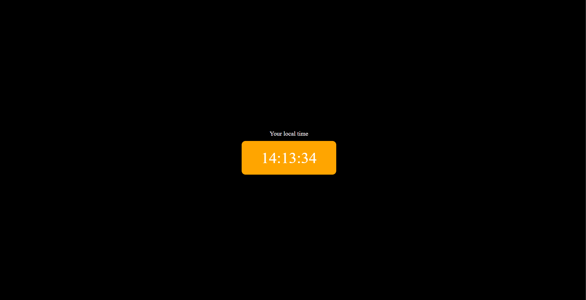

# ⏰ Digital Clock

A responsive Digital Clock built using HTML, CSS and JavaScript.

## ✨ Features

- Real-time clock
- Updates every second
- Responsive UI
- Clean design

## 🛠️ Technologies Used

- HTML5
- CSS3
- JavaScript

## 📸 Preview

## 🚀 Live Demo

[View Live Demo](https://bhumikaa0006-create.github.io/Digital-clock/)

## 👩‍💻 Author

**Bhumika**